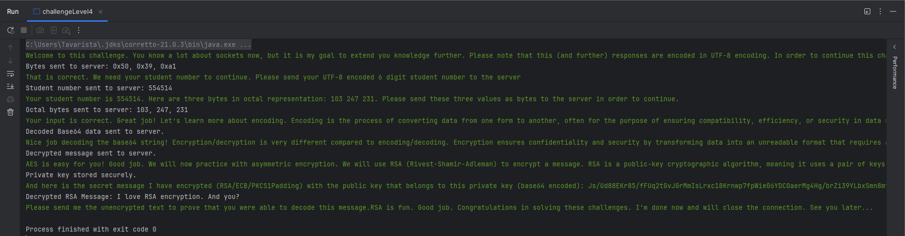

# Challenge Walkthrough

This document outlines the steps I took to solve each level of the challenge, including where I struggled and what worked (or didn’t work) at each stage.

---

## **Level 1: Sending Bytes to the Server**

**Objective**: I was instructed to send specific bytes to the server to continue the challenge.

**What I Did**:
- The server told me to send the bytes `0x50 0x39 0xa1`.
- I simply sent them as raw bytes (not as characters or strings).
- After sending these bytes, I was able to move on to the next level.

**Where I Struggled**:
- There was no real struggle here. It was a simple task of sending the correct bytes.

---

## **Level 2: Sending the Student Number**

**Objective**: I was asked to send my student number (as UTF-8 encoded bytes) to the server.

**What I Did**:
- The server asked for my student number, which was `554514`.
- I sent the number in byte format, making sure it was encoded as UTF-8.

**Where I Struggled**:
- I initially thought there was some other format or encoding required, but it turned out UTF-8 was enough.

---

## **Level 3: Sending Octal Representation**

**Objective**: The server sent some octal values and asked me to send them as bytes.

**What I Did**:
- The server gave me three octal values: `103`, `247`, and `231`.
- I converted them to their byte equivalents (`0x67`, `0xA7`, and `0xF1` respectively).
- I sent these as raw bytes and the server confirmed my input.

**Where I Struggled**:
- At first, I wasn’t sure how to handle the octal numbers and thought I needed to do some complex conversion. It turns out, I just needed to treat them as octal byte values and send them directly.

---

## **Level 4: Base64 Decoding**

**Objective**: I was given a Base64-encoded string and asked to decode it and send the raw output.

**What I Did**:
- The server provided a Base64-encoded string.
- I decoded it using `Base64.getDecoder().decode()`.
- After decoding, I sent the raw byte output to the server.

**Where I Struggled**:
- Initially, I missed that I had to send the raw bytes after decoding. I was trying to send the decoded string, not the raw byte data, but after a quick check, I fixed it and sent the right data.

---

## **Level 5: AES Decryption**

**Objective**: The server gave me an AES-128 encrypted message and asked me to decrypt it.

**What I Did**:
- The server provided both the secret key and the ciphertext (both Base64-encoded).
- I decoded both using `Base64.getDecoder().decode()`.
- I used the AES decryption method with `Cipher.getInstance("AES/ECB/PKCS5Padding")` to decrypt the ciphertext.
- After decrypting the message, I sent it back to the server.

**Where I Struggled**:
- I struggled a bit with understanding the correct AES mode (ECB in this case) and ensuring I had the right padding scheme. But after testing a few different modes, I found that `AES/ECB/PKCS5Padding` was what worked.

---

## **Level 6: RSA Decryption**

**Objective**: Decrypt an RSA-encrypted message using the provided private key and send the result back.

**What I Did**:
- Extracted the private key from the PEM format, decoded it, and converted it into a PrivateKey object.
- Cleaned and decoded the Base64 ciphertext into raw bytes.
- Decrypted the message using RSA/ECB/PKCS1Padding and sent the result to the server.

**Where I Struggled**:
- Figuring out how to handle the PEM-formatted private key.
- Fixing Base64 padding issues in the encrypted message.
- Identifying the correct RSA decryption mode and padding.

**How I Overcame the Struggles**:
- Used Java’s KeyFactory and PKCS8EncodedKeySpec to process the private key.
- Added logic to clean and pad the Base64 ciphertext.
- Experimented with decryption settings until RSA/ECB/PKCS1Padding worked.
---

## **Conclusion**

Each level introduced a new concept in data encoding and encryption. While there were a few struggles along the way (especially with understanding some of the encodings and encryption methods), I was able to get through each challenge by carefully reading the server messages and adjusting my approach as I learned more.

## **Results**
In here is the final result of the extra challenge.

